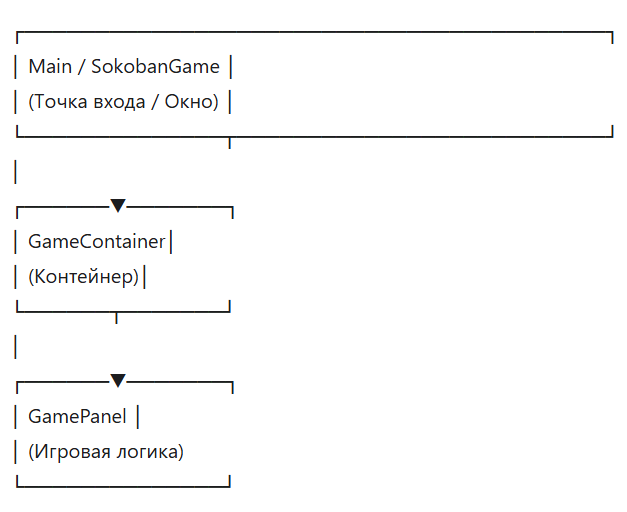

# Архитектура приложения

## Общая структура

Приложение построено по модульному принципу с разделением ответственности между классами:

## Основные компоненты

### 1. **Main.java** / **SokobanGame.java**

- Точка входа в приложение
- Создание основного окна JFrame
- Обработка глобальных событий клавиатуры
- Отображение статусной строки

### 2. **GameContainer.java**

- Контейнер для игровой панели
- Управление UI окнами (таблица рекордов, окно победы)
- Отрисовка оверлеев и интерфейса
- Обработка мыши для UI элементов

### 3. **GamePanel.java**

- Основная игровая логика
- Хранение состояния игры (игрок, ящики, цели)
- Обработка движений и коллизий
- Генерация уровней
- Система отмены ходов
- Отрисовка игрового поля

### 4. **SpriteManager** (graphics)

- Загрузка и хранение спрайтов
- Управление анимациями игрока

### 5. **LevelGenerator** (level)

- Процедурная генерация уровней
- Проверка решаемости

### 6. **ScoreManager** (score)

- Сохранение и загрузка рекордов
- Сортировка результатов

## Паттерны проектирования

### Memento (Хранитель)

Класс **GameState** хранит снимок состояния игры для реализации отмены ходов.

### Singleton (Одиночка)

**SpriteManager** загружает спрайты один раз и переиспользует их.

## Слои приложения

1. **Presentation Layer**: SokobanGame, GameContainer, UI компоненты
2. **Game Logic Layer**: GamePanel, Player, GameBox
3. **Data Layer**: ScoreManager, LevelGenerator
